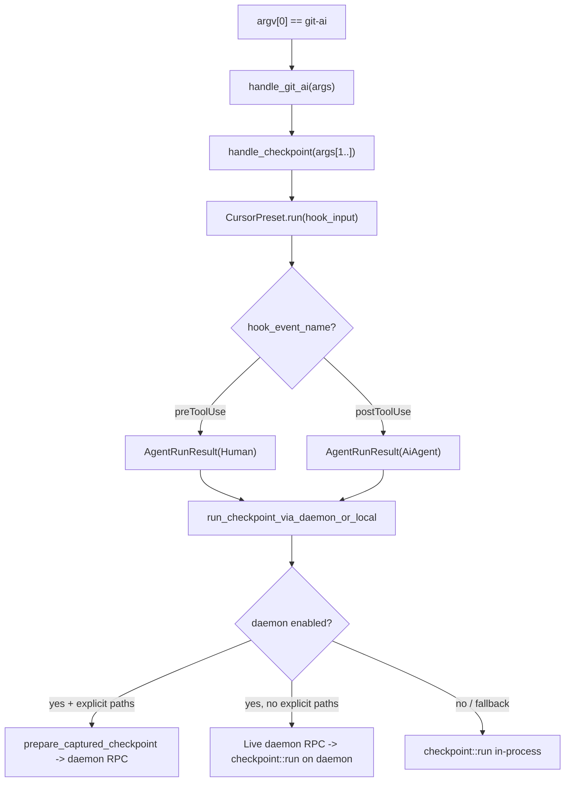
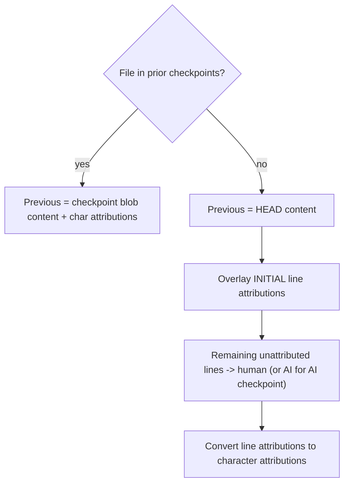
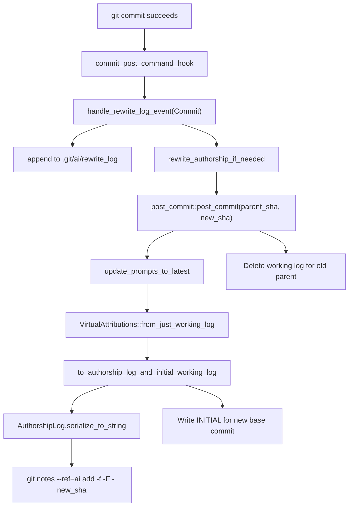
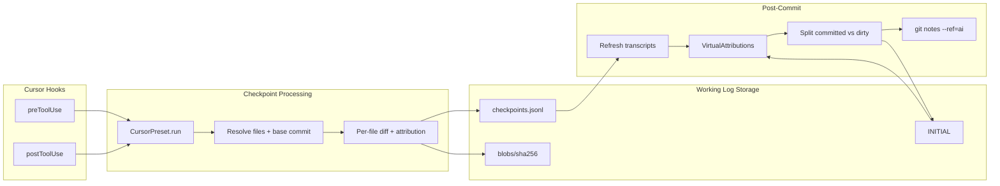

# Checkpoint End-to-End Flow

## Phase 1: Hook Invocation

Cursor installs two hooks into `~/.cursor/hooks.json` via [src/mdm/agents/cursor.rs](src/mdm/agents/cursor.rs) lines 147-161:

```json
{
  "version": 1,
  "hooks": {
    "preToolUse": [{ "command": "/path/to/git-ai checkpoint cursor --hook-input stdin" }],
    "postToolUse": [{ "command": "/path/to/git-ai checkpoint cursor --hook-input stdin" }]
  }
}
```

The hook command strings are defined at [src/mdm/agents/cursor.rs](src/mdm/agents/cursor.rs) lines 17-18:

```
CURSOR_PRE_TOOL_USE_CMD = "checkpoint cursor --hook-input stdin"
CURSOR_POST_TOOL_USE_CMD = "checkpoint cursor --hook-input stdin"
```

### Cursor hook input payload

There is no separate Cursor documentation defining the payload. The expected fields are inferred from what `CursorPreset.run` parses at [src/commands/checkpoint_agent/agent_presets.rs](src/commands/checkpoint_agent/agent_presets.rs) lines 1362-1416:

```json
{
  "conversation_id": "required, string -- Cursor composer thread UUID",
  "workspace_roots": "required, string[] -- absolute paths to workspace folders",
  "hook_event_name": "required, 'preToolUse' | 'postToolUse'",
  "model": "optional, string -- model name e.g. 'claude-4-opus', defaults to 'unknown'",
  "file_path": "optional, string -- absolute path to the file being edited"
}
```

Code pointers for each field extraction:

- `conversation_id`: lines 1366-1372 (`hook_data.get("conversation_id")`, required)
- `workspace_roots`: lines 1374-1382 (`hook_data.get("workspace_roots")`, required, each entry normalized via `normalize_cursor_path`)
- `hook_event_name`: lines 1384-1390 (`hook_data.get("hook_event_name")`, required)
- `model`: lines 1393-1397 (`hook_data.get("model")`, optional, defaults to `"unknown"`)
- `file_path`: lines 1412-1416 (`hook_data.get("file_path")`, optional, defaults to empty string)

Integration tests confirm this shape at [tests/integration/cursor.rs](tests/integration/cursor.rs) lines 375-382:

```json
{
    "conversation_id": "00812842-49fe-4699-afae-bb22cda3f6e1",
    "workspace_roots": ["/path/to/repo"],
    "hook_event_name": "postToolUse",
    "file_path": "/path/to/repo/src/main.rs",
    "model": "model-name-from-hook-test"
}
```

Legacy event names (`"beforeSubmitPrompt"`, `"afterFileEdit"`) cause a silent `process::exit(0)` at lines 1399-1402.

**Per-prompt checkpoint count**: If Cursor makes N tool calls that each edit a file, you get 1 `preToolUse` + N `postToolUse` = N+1 checkpoint invocations. Each `postToolUse` carries a single `file_path`.

---

## Phase 2: CLI Dispatch




### Dispatch chain

1. **[src/main.rs](src/main.rs) line 44-46**: `argv[0] == "git-ai"` -> calls `commands::git_ai_handlers::handle_git_ai(&cli.args)`
2. **[src/commands/git_ai_handlers.rs](src/commands/git_ai_handlers.rs) line 127-129**: `args[0] == "checkpoint"` -> calls `handle_checkpoint(&args[1..])`
3. **[src/commands/git_ai_handlers.rs](src/commands/git_ai_handlers.rs) lines 488-502**: `args[0] == "cursor"` -> runs `CursorPreset.run(AgentCheckpointFlags { hook_input })`, stores result in `agent_run_result`
4. **[src/commands/checkpoint_agent/agent_presets.rs](src/commands/checkpoint_agent/agent_presets.rs) lines 1355-1532**: `CursorPreset.run()` parses the JSON, returns `AgentRunResult`:
  - `preToolUse` -> `AgentRunResult { checkpoint_kind: Human, ... }` (lines 1441-1457)
  - `postToolUse` -> `AgentRunResult { checkpoint_kind: AiAgent, edited_filepaths: Some(vec![file_path]), transcript, ... }` (lines 1523-1532)
5. **[src/commands/git_ai_handlers.rs](src/commands/git_ai_handlers.rs) ~line 955**: calls `run_checkpoint_via_daemon_or_local`

### AgentRunResult struct

Defined at [src/commands/checkpoint_agent/agent_presets.rs](src/commands/checkpoint_agent/agent_presets.rs) lines 23-32:

```rust
pub struct AgentRunResult {
    pub agent_id: AgentId,
    pub agent_metadata: Option<HashMap<String, String>>,
    pub checkpoint_kind: CheckpointKind,
    pub transcript: Option<AiTranscript>,
    pub repo_working_dir: Option<String>,
    pub edited_filepaths: Option<Vec<String>>,
    pub will_edit_filepaths: Option<Vec<String>>,
    pub dirty_files: Option<HashMap<String, String>>,
}
```

### Daemon vs local decision

`run_checkpoint_via_daemon_or_local` in [src/commands/git_ai_handlers.rs](src/commands/git_ai_handlers.rs) ~line 1077:

- **Enabled** when `Config.feature_flags.async_mode` is on or `GIT_AI_DAEMON_CHECKPOINT_DELEGATE=1` (checked by `daemon_checkpoint_delegate_enabled` ~line 1323)
- **Captured async path**: `prepare_captured_checkpoint` ([src/commands/checkpoint.rs](src/commands/checkpoint.rs) line 840) snapshots files + blobs to disk, sends `ControlRequest::CheckpointRun` to daemon via IPC
- **Live daemon path**: sends `CheckpointRunRequest::Live` over IPC, daemon runs `checkpoint::run`
- **Fallback**: Any failure falls back to local in-process `checkpoint::run` ([src/commands/checkpoint.rs](src/commands/checkpoint.rs) line 309)

---

## Phase 3: Checkpoint Execution (`checkpoint::run`)

Entry point: [src/commands/checkpoint.rs](src/commands/checkpoint.rs) `run` (line 309) -> `run_with_base_commit_override_with_policy` (line 355).

### 3a. Resolve execution parameters

`resolve_live_checkpoint_execution` at [src/commands/checkpoint.rs](src/commands/checkpoint.rs) line 489:

- **Base commit** (line 497): current HEAD SHA via `resolve_base_commit(repo, base_commit_override)` -- the commit these edits are relative to
- **Ignore patterns** (line 508): `.gitignore` + `.git-ai-ignore` rules via `effective_ignore_patterns`
- **Pre-commit fast path** (lines 519-533): If no AI edits exist in the working log (`all_ai_touched_files().is_empty()`) and no INITIAL attributions, returns `Ok(None)` to skip
- **Pathspec filtering** (line 545): `filtered_pathspecs_for_agent_run_result` (line 397) extracts `edited_filepaths` or `will_edit_filepaths` from `AgentRunResult`, normalizes to repo-relative POSIX paths
- **File list** (lines 601-615): `get_all_tracked_files` (line 1107) unions: explicit `edited_filepaths` from the agent + files from INITIAL attributions (line 1145) + files from prior checkpoints (line 1169) + dirty files (line 1219)

### 3b. Save file states (blob storage)

`save_current_file_states` at [src/commands/checkpoint.rs](src/commands/checkpoint.rs) line 1266:

- Processes files concurrently (8 at a time via semaphore, line 1280)
- For each file, reads content from `dirty_files` map first, then falls back to filesystem (lines 1296-1310)
- Computes SHA-256 hash of content (lines 1313-1315)
- Writes raw text to `.git/ai/working_logs/<base_sha>/blobs/<sha256_hex>` (lines 1318-1322)
- Returns `HashMap<file_path, content_hash>` (line 1324)

### 3c. Compute combined hash

[src/commands/checkpoint.rs](src/commands/checkpoint.rs) lines 676-685: Sorts `(file_path, content_hash)` pairs, feeds them into a SHA-256 hasher to produce a single `combined_hash` (stored as `Checkpoint.diff` -- acts as a content fingerprint, not a textual diff).

### 3d. Generate checkpoint entries

`get_checkpoint_entries` (async) at [src/commands/checkpoint.rs](src/commands/checkpoint.rs) line 1637:

- Reads INITIAL attributions + snapshot contents from working log (lines 1653-1663)
- Calls `build_previous_file_state_maps` (line 1383) to get per-file last-known `(blob_sha, attributions)` from prior checkpoints -- later checkpoints overwrite earlier ones per file (lines 1390-1407)
- Sets `author_id`: AI checkpoints use a short hash from agent_id; human checkpoints use `"human"` (lines 1678-1694)
- Spawns up to 30 concurrent tasks (semaphore at line 1710), one per file (lines 1728-1771)
- Each task calls `get_checkpoint_entry_for_file` (line 1751)

---

## Phase 4: Per-File Attribution Logic

`get_checkpoint_entry_for_file` at [src/commands/checkpoint.rs](src/commands/checkpoint.rs) line 1413 is the core of attribution tracking.

### 4a. Determine previous state




Code pointers:

- **From prior checkpoint** (lines 1477-1487): `working_log.get_file_version(&state.blob_sha)` for content, `state.attributions` for char-level attributions
- **From HEAD** (line 1490+): `get_previous_content_from_head` retrieves file content from the HEAD commit tree
- **INITIAL overlay**: `initial_attrs_for_file` from INITIAL data are applied line-by-line
- **No-change short circuit** (lines 1622-1624): if content from checkpoint matches current content, returns `Ok(None)`

### 4b. Fast paths (skip unchanged files)

All in [src/commands/checkpoint.rs](src/commands/checkpoint.rs):

- Pre-commit + human + no prior AI touch + no INITIAL -> `Ok(None)` (lines 1444-1450)
- From prior checkpoint and content unchanged -> `Ok(None)` (lines 1622-1624)
- Human + no AI history -> emit entry with empty attributions, stats only (lines 1459+)

### 4c. `make_entry_for_file`

[src/commands/checkpoint.rs](src/commands/checkpoint.rs) line 1827. Three steps using `AttributionTracker` from [src/authorship/attribution_tracker.rs](src/authorship/attribution_tracker.rs):

**Step 1 - Fill gaps** (lines 1843-1849): `tracker.attribute_unattributed_ranges()` -- any byte range in previous content not covered by an existing `Attribution` gets attributed to `"human"` at `ts - 1`

**Step 2 - Diff and transform** (lines 1857-1864): `tracker.update_attributions_for_checkpoint()`:

- Runs Myers line diff (`capture_diff_slices` in [src/authorship/attribution_tracker.rs](src/authorship/attribution_tracker.rs) `compute_diffs` method) then converts to byte-level `ByteDiff` operations
- `transform_attributions` walks equal/delete/insert ops:
  - **Equal**: copy old attributions to new byte positions
  - **Delete**: for AI, marks deletion points; for human, may detect moves
  - **Insert (AI checkpoint)**: entire insertion attributed to `author_id` (session hash) at `ts`
  - **Insert (human checkpoint)**: substantive inserts -> human; whitespace formatting may inherit from context
- `merge_attributions` -- sort, dedup, coalesce adjacent same-author ranges

**Step 3 - Line export** (lines 1875-1880): `attributions_to_line_attributions_for_checkpoint()` in [src/authorship/attribution_tracker.rs](src/authorship/attribution_tracker.rs):

- For each line, finds dominant author among overlapping character attributions (highest `ts` wins, via `find_dominant_author_for_line_candidates`)
- Sets `overrode` field when a human edit overwrites an AI-attributed line
- Drops human-only lines from stored `line_attributions` (unless they have `overrode`)

**Build entry** (lines 1896-1901): `WorkingLogEntry::new(file_path, blob_sha, new_attributions, line_attributions)`

### 4d. WorkingLogEntry struct

Defined at [src/authorship/working_log.rs](src/authorship/working_log.rs) lines 12-23:

```rust
pub struct WorkingLogEntry {
    pub file: String,                          // repo-relative path
    pub blob_sha: String,                      // SHA-256 hex of file content
    pub attributions: Vec<Attribution>,         // character-level byte ranges
    pub line_attributions: Vec<LineAttribution>, // line-level ranges (1-based)
}
```

---

## Phase 5: Checkpoint Persistence

`execute_resolved_checkpoint` at [src/commands/checkpoint.rs](src/commands/checkpoint.rs) line 637 builds the `Checkpoint` struct (lines 712-727) and calls `working_log.append_checkpoint()`.

### On-disk layout

Rooted at [src/git/repo_storage.rs](src/git/repo_storage.rs) lines 47-58 (`.git/ai/` directory), per-base-commit at lines 86-103:

```
.git/ai/working_logs/<base_commit_sha>/
  checkpoints.jsonl    -- one JSON object per line, each a serialized Checkpoint
  blobs/
    <sha256_hex>       -- raw file content, deduplicated by hash
  INITIAL              -- optional, pretty JSON of InitialAttributions
```

### Checkpoint struct

Defined at [src/authorship/working_log.rs](src/authorship/working_log.rs) lines 103-121:

```rust
pub struct Checkpoint {
    pub kind: CheckpointKind,        // Human | AiAgent | AiTab  (line 49-54)
    pub diff: String,                // combined SHA-256 hash (content fingerprint)
    pub author: String,
    pub entries: Vec<WorkingLogEntry>,
    pub timestamp: u64,
    pub transcript: Option<AiTranscript>,
    pub agent_id: Option<AgentId>,   // { tool, id, model }  (lines 42-47)
    pub agent_metadata: Option<HashMap<String, String>>,
    pub line_stats: CheckpointLineStats, // additions, deletions, additions_sloc, deletions_sloc  (lines 89-101)
    pub api_version: String,         // "checkpoint/1.0.0"  (line 9)
    pub git_ai_version: Option<String>,
}
```

### append_checkpoint

[src/git/repo_storage.rs](src/git/repo_storage.rs) lines 337-395:

1. Reads existing checkpoints from JSONL (line 339)
2. Optionally strips transcript for tools that can refetch (lines 348-384 -- cursor is always stripped since it can refetch from its SQLite DB, line 363)
3. Pushes new checkpoint (line 387)
4. Prunes old character attributions from earlier checkpoints for the same files (line 391)
5. Rewrites the full JSONL file (line 394)

### read_all_checkpoints

[src/git/repo_storage.rs](src/git/repo_storage.rs) lines 397-425: parses `checkpoints.jsonl` line-by-line, skips lines with wrong `api_version`, migrates 7-char prompt hashes to 16-char (lines 427+).

---

## Phase 6: Post-Commit (Working Log -> Git Note)

Triggered by `git commit` through the git proxy's post-command hook.




### 6a. Post-commit hook entry

[src/commands/hooks/commit_hooks.rs](src/commands/hooks/commit_hooks.rs) `commit_post_command_hook` (lines 37-99):

- Guards: skip if dry-run (line 43), git failed (line 47), or user's pre-commit hook failed (lines 51-56)
- Gets original parent commit from `repository.pre_command_base_commit` (line 63)
- Gets new commit SHA from `repository.head()` (line 64)
- Calls `repository.handle_rewrite_log_event(RewriteLogEvent::commit(original_commit, new_sha), ...)` (lines 89-94)

### 6b. Rewrite log dispatch

[src/git/repository.rs](src/git/repository.rs) `handle_rewrite_log_event` (lines 1231-1265): appends event to `.git/ai/rewrite_log`, then calls `rewrite_authorship_if_needed`.

[src/authorship/rebase_authorship.rs](src/authorship/rebase_authorship.rs) `rewrite_authorship_if_needed` (lines 37-54): for `RewriteLogEvent::Commit`, dispatches to `post_commit::post_commit(repo, base_commit, commit_sha, ...)` (lines 47-53).

### 6c. post_commit function

[src/authorship/post_commit.rs](src/authorship/post_commit.rs) `post_commit` (line 52) -> `post_commit_with_final_state` (line 69):

1. Opens working log for parent SHA (line 83): `repo_storage.working_log_for_base_commit(&parent_sha)`
2. **Refresh transcripts** (lines 87-90): `working_log.mutate_all_checkpoints(|checkpoints| update_prompts_to_latest(checkpoints))` -- groups checkpoints by `tool:id`, refetches transcript from tool storage (e.g. Cursor SQLite DB) for the **last** checkpoint per agent only
3. **Build virtual attributions** (lines 110-124): `VirtualAttributions::from_just_working_log()` loads INITIAL + all checkpoints, replays attributions forward
4. **Split committed vs uncommitted**: `to_authorship_log_and_initial_working_log` diffs parent tree vs new commit tree:
  - Lines **committed** with non-human attribution -> `AuthorshipLog` attestation entries
  - Lines **still dirty** -> carried forward as `InitialAttributions` keyed by new commit SHA

### 6d. Serialize and write note

**AuthorshipLog struct** at [src/authorship/authorship_log_serialization.rs](src/authorship/authorship_log_serialization.rs) lines 114-119:

```rust
pub struct AuthorshipLog {
    pub attestations: Vec<FileAttestation>,  // lines 94-99
    pub metadata: AuthorshipMetadata,
}
```

Where `FileAttestation` (lines 94-99) contains `file_path` + `Vec<AttestationEntry>`, and `AttestationEntry` (lines 53-59) contains `hash` (prompt short hash) + `Vec<LineRange>`.

**Serialization format** at [src/authorship/authorship_log_serialization.rs](src/authorship/authorship_log_serialization.rs) `serialize_to_string` (lines 155-186):

```
src/foo.rs
  abc123def4567890 1-15,20-30
  fed987654321abcd 16-19
src/bar.rs
  abc123def4567890 1-50
---
{
  "schema_version": "authorship/3.0.0",
  "base_commit_sha": "...",
  "prompts": {
    "abc123def4567890": {
      "agent_id": { "tool": "cursor", "id": "...", "model": "..." },
      "messages": [...],
      ...
    }
  }
}
```

Top section: human-readable attestation block (file path, then indented `hash line_ranges`).
Bottom section (after `---`): JSON metadata with prompts keyed by the same hashes.

**Writing the git note** at [src/git/refs.rs](src/git/refs.rs) `notes_add` (lines 13-31):

```
git notes --ref=ai add -f -F - <commit_sha>
```

Note content is piped via stdin to avoid command line length limits (line 28).

### 6e. Cleanup

- Old working log directory (`.git/ai/working_logs/<parent_sha>/`) is deleted via `delete_working_log_for_base_commit` at [src/git/repo_storage.rs](src/git/repo_storage.rs) line 105
- New INITIAL written to `.git/ai/working_logs/<new_sha>/INITIAL` if there are uncommitted attributed lines

---

## Summary: Data Flow Through the System




